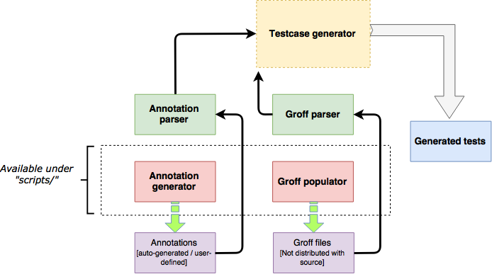

# Smoke testing of base utilities (FreeBSD)

This repo is currently a subset of a broader task which is to be done during [Google Summer of Code '17 with FreeBSD](https://summerofcode.withgoogle.com/projects/#6426676740227072).  
**Refer the [FreeBSD wiki](https://wiki.freebsd.org/SummerOfCode2017/SmokeTestingOfBaseUtilities) for an overview and updates.**

## Directory Structure
```
.
├── deprecated_tests
│   └── ........................:: Tests pertaining to initial test plan
└── src ........................:: Automation tool pertaining to new test plan
    ├── annotations
    │   └── ....................:: Annotation files (generated/user-defined)
    ├── generated_tests
    │   └── ....................:: Generated atf-sh test scripts
    ├── scripts
    │   └── ....................:: Handy scripts
    ├── generate_test.cpp ......:: Test generator
    ├── read_annotations.cpp ...:: Annotation parser
    └── utils.cpp ..............:: Index generator
```

## Automation tool
An (in-progress) implementation of the automation tool briefly described [here](https://lists.freebsd.org/pipermail/soc-status/2017-July/001079.html).  
The following diagram summarizes how different components fit with the testcase-generator -  



- - -

### Instructions
* The directory `src/groff` should be populated with the relevant groff scripts before proceeding. These scripts are available in the FreeBSD src tree.  
  **NOTE:** It should be noted that the directory [generated_tests](src/generated_tests) is already populated with demo-tests. Unless testing, there won't be a need to proceed to the next step.

* Execute the following commands inside [src](src) -
  ```
  make clean
  make && make run
  ```
  The expected result (at the time of writing) should be generation of 3 atf-sh test files under [generated_tests](generated_tests).

## Generated tests
**NOTE:** The generated tests are maintained at [shivrai/smoketests](https://github.com/shivrai/smoketests). The directory [generated_tests](src/generated_tests) only contains a few demos.  
The following table summarizes the type of test-cases produced for 3 (randomly chosen) utilities.

|           **Test**            | **Positive test-cases** | **Negative test-cases** |
--------------------------------|:-----------------------:|:-----------------------:|
[date_test.sh](src/generated_tests/date_test.sh)    | ~~5~~ 0 | ~~2~~ 6
[ln_test.sh](src/generated_tests/ln_test.sh)        | 0       | 11
[stdbuf_test.sh](src/generated_tests/stdbuf_test.sh)| 1       | ~~0~~ 3

Some key-points worth noting :
* [date_test.sh](src/generated_tests/date_test.sh) is time/timezone dependent, hence all the test-cases apart from `invalid_usage` will fail. The aim for using this utility is to demonstrate that the tool can generate positive test-cases along with negative ones. It also demonstrates the need to sanity check the tests.
  - After adding functionality to generate annotations, the 5 timezone dependent testcases were removed.
  - Adding functionality for long options increased the number of negative testcases by 4.

* [ln_test.sh](src/generated_tests/ln_test.sh) demonstrates that if the utility produces a common usage message for every invalid usage, then the tool can define a variable containing this message and avoid duplication while generating the test-cases. Also, all the negative tests are collated under a single testcase named `invalid_usage`.

* The groff script for `stdbuf(1)` is slightly different than others, hence
the tool couldn’t generate any negative test-case in [stdbuf_test.sh](src/generated_tests/stdbuf_test.sh) as it couldn't pick up the supported options. This scenario will be taken into account next. The aim for using this utility is to demonstrate that the tool will always produce atleast one positive/negative testcase.
  - Adding functionality for long options increased the number of negative testcases by 3.
